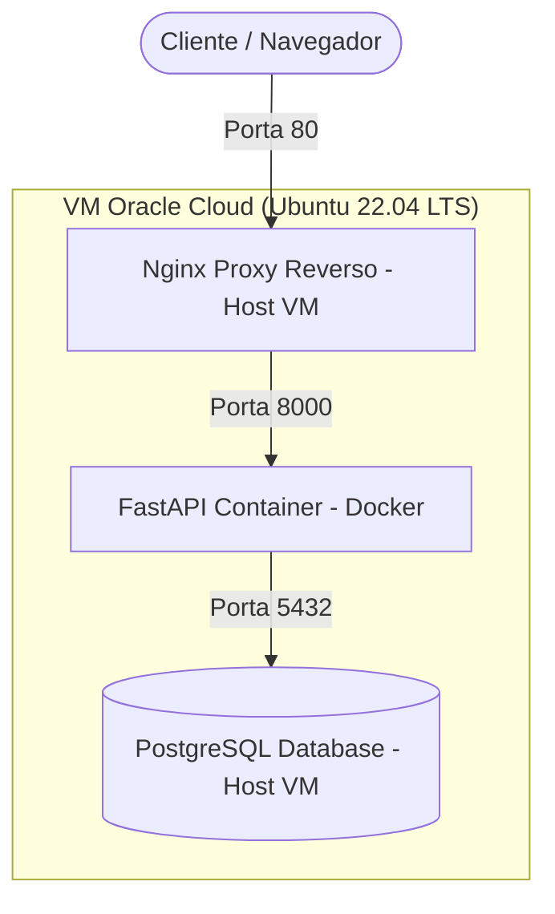

# DevOps API Cloud (Base de Portfólio)

Este projeto consiste em uma infraestrutura completa de API com banco de dados relacional isolado e proxy reverso de alto desempenho, desenvolvido com foco em boas práticas de arquitetura de software, segurança de credenciais e conteinerização profissional. 

A aplicação foi publicada com sucesso em uma máquina virtual (VM) na **Oracle Cloud Infrastructure (OCI)** e está rodando publicamente sob o subdomínio:
👉 **[http://api.bravvi.tec.br/health](http://api.bravvi.tec.br/health)**

---

## 🏗️ Arquitetura do Sistema e Fluxo de Rede

O tráfego de rede e o provisionamento seguem o seguinte modelo de arquitetura:



### Detalhes de Segurança e Roteamento:
1. **Proxy Reverso:** O Nginx nativo no host da VM escuta na porta 80, gerencia o tráfego do subdomínio `api.bravvi.tec.br` e faz o repasse de cabeçalhos reais (`X-Real-IP`, `X-Forwarded-For`) para a API.
2. **Isolamento de Portas:** A porta `8000` da API FastAPI não está aberta diretamente para a internet no firewall da nuvem; ela aceita conexões apenas através do proxy do Nginx.
3. **Controle de Acesso ao Banco:** A porta do PostgreSQL (`5432`) foi aberta nas Security Lists da Oracle Cloud especificamente para o IP de desenvolvimento, e as políticas do arquivo `pg_hba.conf` foram restringidas para aceitar conexões externas exclusivamente para o banco `devops_db` e o usuário `fabricio_devops`.

---

## 🛠️ Tecnologias e Bibliotecas Utilizadas

- **Core do Backend:** Python 3.11, FastAPI (para rotas assíncronas e documentação interativa integrada)
- **Banco de Dados & Persistência:** PostgreSQL (Banco Relacional), SQLAlchemy 2.0 (ORM para mapeamento declarativo e consultas)
- **Validação de Dados:** Pydantic v2 (para validação rígida de schemas de entrada e saída)
- **Segurança de Variáveis:** `python-dotenv` (carregamento dinâmico de ambientes locais)
- **Infraestrutura & Deploy:** Docker, Docker Compose (orquestração dos serviços), Nginx (Proxy Reverso), OCI (Oracle Cloud Infrastructure)

---

## 📂 Estrutura de Pastas Profissional

O projeto foi organizado de forma modular seguindo padrões industriais de engenharia de software:

```text
devops-api-cloud/
├── src/                    # Código-fonte principal da API
│   ├── main.py             # Ponto de entrada (FastAPI, Middlewares e HealthCheck)
│   ├── routes/             # Módulos de Rotas (CRUD de Tarefas - Tasks)
│   │   ├── __init__.py
│   │   └── tasks.py        # Endpoints e Schemas Pydantic
│   ├── models/             # Mapeamento do Banco de Dados
│   │   ├── __init__.py
│   │   └── task.py         # Classe Task (Tabela no Postgres)
│   └── database/           # Configuração de Conexão com o Banco
│       ├── __init__.py
│       └── db.py           # Session Maker e Engine SQLAlchemy
├── infra/                  # Configurações de Redes e Infraestrutura
│   └── nginx/              # Configurações de teste do Nginx
├── docker/                 # Arquivos de Build
│   └── Dockerfile          # Dockerfile multi-stage otimizado para Python
├── config/                 # Templates de Configuração
│   └── .env.example        # Modelo de variáveis (Zero Hardcoded)
├── logs/                   # Diretório reservado para registros da API
├── tests/                  # Diretório de testes unitários/integração
├── docs/                   # Planejamentos e anotações do projeto
├── docker-compose.yml      # Configuração de containers locais
├── requirements.txt        # Dependências do projeto
├── Procfile & runtime.txt  # Suporte para deploys PaaS adicionais (ex: Azure)
└── README.md               # Esta documentação técnica
```

---

## 🚀 Como Executar o Projeto

### 💻 1. Executando Localmente (Windows/Linux)

#### Requisitos Prévios:
- Python 3.11 instalado
- Banco de dados PostgreSQL rodando

#### Passos para execução:
```bash
# 1. Clone o projeto e entre na pasta
git clone https://github.com/Fabricio-O-S/devops-api-cloud.git
cd devops-api-cloud

# 2. Crie e ative o ambiente virtual
python -m venv .venv
# No Windows (PowerShell):
.\.venv\Scripts\Activate.ps1
# No Linux:
source .venv/bin/activate

# 3. Instale as dependências
pip install -r requirements.txt

# 4. Configure o arquivo .env
cp config/.env.example .env
# Edite o .env com as credenciais do seu banco de dados local

# 5. Execute a API com hot-reload ativo
uvicorn src.main:app --reload
```
A API local estará disponível em `http://localhost:8000` e a documentação interativa em `http://localhost:8000/docs`.

---

### ☁️ 2. Executando na VM Oracle Cloud (Deploy Real)

#### Configuração das Variáveis na VM:
Na pasta clonada na VM, crie o `.env`:
```bash
cp config/.env.example .env
```
Edite as credenciais para apontar para o IP público da própria VM (`DB_HOST=147.15.122.49`), informando o usuário e senha corretos do banco de dados configurado no servidor.

#### Início dos containers:
Execute o Docker Compose na VM para subir o container da API de forma isolada:
```bash
docker compose up -d --build
```

#### Regras no Nginx Central da VM:
Crie um arquivo em `/etc/nginx/sites-available/api.bravvi.tec.br` com a seguinte regra de proxy reverso:
```nginx
server {
    listen 80;
    server_name api.bravvi.tec.br;

    location / {
        proxy_pass http://127.0.0.1:8000;
        proxy_set_header Host $host;
        proxy_set_header X-Real-IP $remote_addr;
        proxy_set_header X-Forwarded-For $proxy_add_x_forwarded_for;
        proxy_set_header X-Forwarded-Proto $scheme;
    }
}
```
Ative o domínio criando o link simbólico e reiniciando o serviço:
```bash
sudo ln -s /etc/nginx/sites-available/api.bravvi.tec.br /etc/nginx/sites-enabled/
sudo systemctl restart nginx
```

---

## 🧠 O que aprendi neste projeto

- **Orquestração com Docker:** Criação de imagens customizadas leves e gerenciamento de variáveis de ambiente de forma segura (`.env` isolado no `.gitignore`), aplicando o conceito de *Twelve-Factor App* (Zero Hardcoded).
- **Segurança de Acesso PostgreSQL:** Como configurar permissões granulares de acesso a banco de dados em rede pública usando o `pg_hba.conf` do Postgres e as regras de entrada da Oracle Cloud (OCI).
- **Proxy Reverso com Nginx:** Entendimento prático de roteamento HTTP, direcionando domínios/subdomínios específicos para portas internas de containers isolados sem expor os mesmos diretamente para a internet.
- **Resolução de Problemas de Rede (Troubleshooting):** Diagnóstico de conexões usando ferramentas como `Test-NetConnection` e análise de logs em tempo real para encontrar divergências em permissões e credenciais de usuários e portas ocupadas no host.
